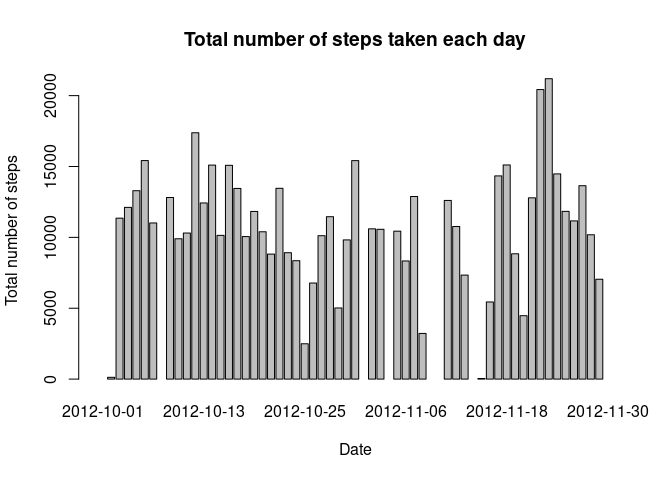
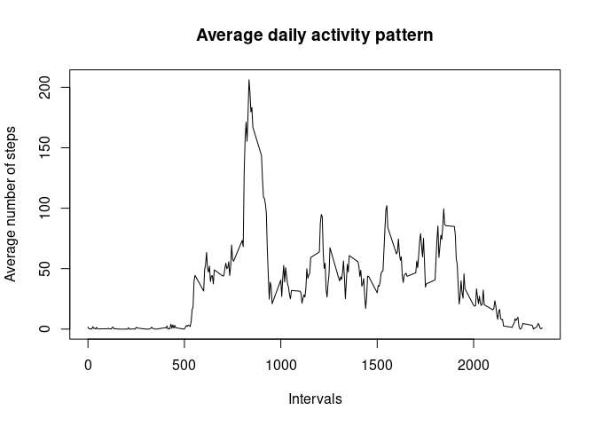
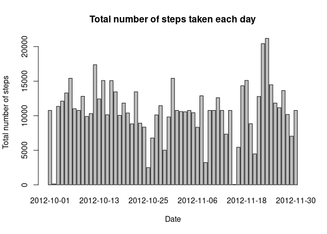
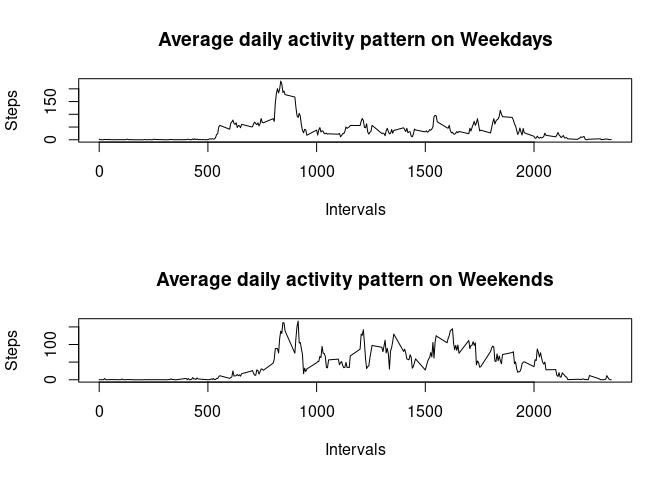

## Loading and preprocessing the data

First, the data is unzipped, if it hasn't been done already.

```r
if(!file.exists('activity.csv')){
    unzip('activity.zip') 
}
```

Next, the data is loaded and inspected.

```r
data <- read.csv('activity.csv')
head(data)
```

```
##   steps       date interval
## 1    NA 2012-10-01        0
## 2    NA 2012-10-01        5
## 3    NA 2012-10-01       10
## 4    NA 2012-10-01       15
## 5    NA 2012-10-01       20
## 6    NA 2012-10-01       25
```

```r
str(data)
```

```
## 'data.frame':	17568 obs. of  3 variables:
##  $ steps   : int  NA NA NA NA NA NA NA NA NA NA ...
##  $ date    : chr  "2012-10-01" "2012-10-01" "2012-10-01" "2012-10-01" ...
##  $ interval: int  0 5 10 15 20 25 30 35 40 45 ...
```

```r
summary(data)
```

```
##      steps            date              interval     
##  Min.   :  0.00   Length:17568       Min.   :   0.0  
##  1st Qu.:  0.00   Class :character   1st Qu.: 588.8  
##  Median :  0.00   Mode  :character   Median :1177.5  
##  Mean   : 37.38                      Mean   :1177.5  
##  3rd Qu.: 12.00                      3rd Qu.:1766.2  
##  Max.   :806.00                      Max.   :2355.0  
##  NA's   :2304
```

There is no need to process/transform the data into a format suitable for this analysis.


## What is mean total number of steps taken per day?

Calculate the total number of steps taken per day

```r
totalStepsByDay <- aggregate(data$steps, by=list(date=data$date), sum)
head(totalStepsByDay)
```

```
##         date     x
## 1 2012-10-01    NA
## 2 2012-10-02   126
## 3 2012-10-03 11352
## 4 2012-10-04 12116
## 5 2012-10-05 13294
## 6 2012-10-06 15420
```
Make a histogram of the total number of steps taken each day

```r
barplot(
    totalStepsByDay$x,
    names.arg = totalStepsByDay$date,
    xlab = 'Date',
    ylab = 'Total number of steps',
    main = 'Total number of steps taken each day'
    )
```

<!-- -->

Calculate and report the mean and median of the total number of steps taken per day

```r
meanTotalStepsByDay <- mean(totalStepsByDay$x, na.rm = TRUE)
meanTotalStepsByDay
```

```
## [1] 10766.19
```


```r
medianTotalStepsByDay <- median(totalStepsByDay$x, na.rm = TRUE)
medianTotalStepsByDay
```

```
## [1] 10765
```


## What is the average daily activity pattern?

Make a time series plot of the 5-minute interval (x-axis) and the average number of steps taken, averaged across all days (y-axis)

Get average number of steps by interval

```r
avgStepsbyInterval <- aggregate(steps ~ interval, data, mean)
head(avgStepsbyInterval)
```

```
##   interval     steps
## 1        0 1.7169811
## 2        5 0.3396226
## 3       10 0.1320755
## 4       15 0.1509434
## 5       20 0.0754717
## 6       25 2.0943396
```
Make time series plot

```r
plot(
    avgStepsbyInterval$interval,
    avgStepsbyInterval$steps,
    type = 'l',
    xlab = 'Intervals',
    ylab = 'Average number of steps',
    main = 'Average daily activity pattern')
```

<!-- -->

Which 5-minute interval, on average across all the days in the dataset, contains the maximum number of steps?

```r
interval <- which.max(avgStepsbyInterval$steps)
interval
```

```
## [1] 104
```

```r
maxSteps <- avgStepsbyInterval$interval[interval]
maxSteps
```

```
## [1] 835
```

```
## [1] "5-minute interval 104 contains the maximum number of steps 835"
```


## Imputing missing values

Calculate and report the total number of missing values in the dataset


```r
totalMissing <- sum(is.na(data))
```


```
## [1] "Total number of missing values in this database is 2304"
```

The mean for that 5-minute interval will be used to sill in all the missing values in the dataset.

Create a new dataset that is equal to the original dataset but with the missing data filled in.

```r
#Copy dataset
data2 <- data
numberOfObs <- nrow(data2)
rowIndex <- 1
# Loop through the missing values and fill them
while(rowIndex <= numberOfObs){
    if(is.na(data2$steps[rowIndex])){
        rowInterval <- data2$interval[rowIndex]
        data2$steps[rowIndex] = avgStepsbyInterval$steps[
            which(avgStepsbyInterval$interval==rowInterval)
            ]
    }
    rowIndex <- rowIndex + 1
}
head(data2)
```

```
##       steps       date interval
## 1 1.7169811 2012-10-01        0
## 2 0.3396226 2012-10-01        5
## 3 0.1320755 2012-10-01       10
## 4 0.1509434 2012-10-01       15
## 5 0.0754717 2012-10-01       20
## 6 2.0943396 2012-10-01       25
```

Make a histogram of the total number of steps taken each day

```r
totalStepsByDay2 <- aggregate(data2$steps, by=list(date=data$date), sum)
head(totalStepsByDay)
```

```
##         date     x
## 1 2012-10-01    NA
## 2 2012-10-02   126
## 3 2012-10-03 11352
## 4 2012-10-04 12116
## 5 2012-10-05 13294
## 6 2012-10-06 15420
```


```r
barplot(
    totalStepsByDay2$x,
    names.arg = totalStepsByDay2$date,
    xlab = 'Date',
    ylab = 'Total number of steps',
    main = 'Total number of steps taken each day'
    )
```

<!-- -->
Calculate and report the mean and median total number of steps taken per day.


```r
meanTotalStepsByDay2 <- mean(totalStepsByDay2$x, na.rm = TRUE)
meanTotalStepsByDay2
```

```
## [1] 10766.19
```


```r
medianTotalStepsByDay2 <- median(totalStepsByDay2$x, na.rm = TRUE)
medianTotalStepsByDay2
```

```
## [1] 10766.19
```

Do these values differ from the estimates from the first part of the assignment?
*Yes, the median value is different (new - 10766.19, old - 10765) and the same as the mean now.*

What is the impact of inputting missing data on the estimates of the total daily number of steps?
*There is very little impact on the estimates of daily number of steps. The mean remained the same and the median changed ever so slightly.*

## Are there differences in activity patterns between weekdays and weekends?

For this part the weekdays() function may be of some help here. Use the dataset with the filled-in missing values for this part.

Create a new factor variable in the dataset with two levels – “weekday” and “weekend” indicating whether a given date is a weekday or weekend day.

```r
day_type <- function(date){
  day <- as.POSIXlt(as.Date(date))$wday
  return( ifelse(day == 0 || day == 6, 'Weekend', 'Weekday') )
}

data2$dayType <- as.factor(sapply(data2$date,day_type))
head(data2)
```

```
##       steps       date interval dayType
## 1 1.7169811 2012-10-01        0 Weekday
## 2 0.3396226 2012-10-01        5 Weekday
## 3 0.1320755 2012-10-01       10 Weekday
## 4 0.1509434 2012-10-01       15 Weekday
## 5 0.0754717 2012-10-01       20 Weekday
## 6 2.0943396 2012-10-01       25 Weekday
```

Make a panel plot containing a time series plot of the 5-minute interval (x-axis) and the average number of steps taken, averaged across all weekday days or weekend days (y-axis).


```r
par(mfrow=c(2, 1))

#Weekday
avgStepsbyIntervalWeekday <- aggregate(steps ~ interval, data2, subset = (data2$dayType == 'Weekday'), mean)
plot(
    avgStepsbyIntervalWeekday$interval,
    avgStepsbyIntervalWeekday$steps,
    type = 'l',
    xlab = 'Intervals',
    ylab = 'Steps',
    main = 'Average daily activity pattern on Weekdays')

#Weekend
avgStepsbyIntervalWeekend <- aggregate(steps ~ interval, data2, subset = (data2$dayType == 'Weekend'), mean)
plot(
    avgStepsbyIntervalWeekend$interval,
    avgStepsbyIntervalWeekend$steps,
    type = 'l',
    xlab = 'Intervals',
    ylab = 'Steps',
    main = 'Average daily activity pattern on Weekends')
```

<!-- -->

